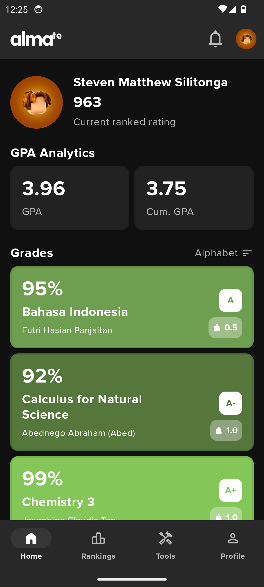
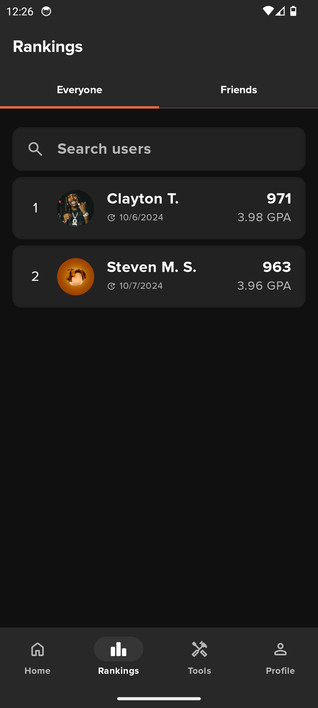
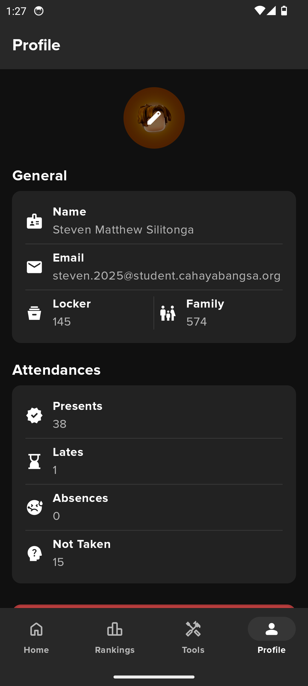

   

  

# Almate

Almate is an unofficial interpretation of how the alma (SIS) native android app should look, built with [Jetpack Compose][compose]. It works by web scraping the alma website, using a user's credentials. User credentials are NOT stored on any database that belongs to Almate, but rather on users' devices locally.

To try out this app, either download it, or use the latest stable version
of [Android Studio](https://developer.android.com/studio) to compile it.
You can clone this repository or import the
project from Android Studio following the steps
[here](https://developer.android.com/jetpack/compose/setup#sample).

Features:
* GPA calculator
* Ranking system

Features to come:
* AI chatbot (with Gemini for Android)
* AI grade predictor

## Screenshots
  

## License
This project is under no license. Please feel free to message me at @smattsil on IG if you have any problems or legal issues you would like to address.

[compose]: https://developer.android.com/jetpack/compose
